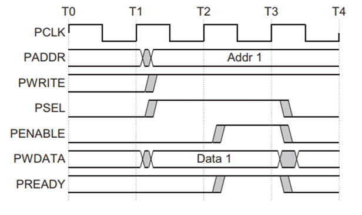
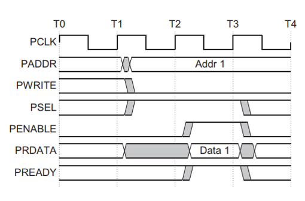
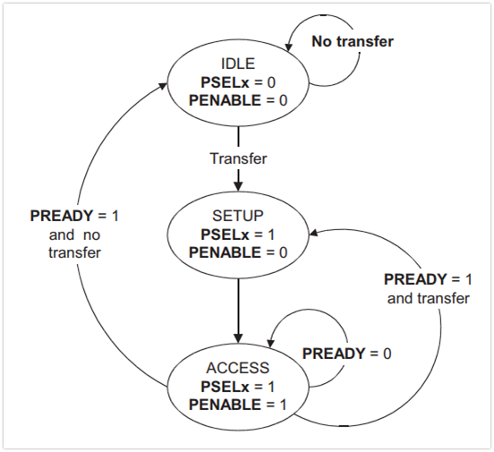

## APB Protocol


#### Description

Advanced Peripheral Bus (APB) is the part of Advanced Microcontroller Bus Architecture (AMBA) family protocols. The latest version of APB is v2.0, which was a part of AMBA 4 release. It is a low-cost interface and it is optimized for minimal power consumption and reduced interface complexity. Unlike AHB, it is a Non-Pipelined protocol, used to connect low-bandwidth peripherals. Mostly, it is used to connect the external peripheral to the SOC. In APB, every transfer takes at least two clock cycles (SETUP Cycle and ACCESS Cycle) to complete. It can also interface with AHB and AXI protocols using the bridges in between.

#### Signals from a APB master to APB slave

```md
- PCLK
System clock
- PRESETn
Active low asynchronous reset
- PADDR
Generally a 32 bit wide address bus from master to slave
- PWDATA
Generally a 32 bit wide write data bus from master to slave
- PRDATA
Generally a 32 bit wide read data bus from slave to master
- PSELx
There is a PSELx(slave select signal) for each slave "x" connected to the master. Used to determine which slave is selected by master at the moment
- PENABLE (similar to HTRANS of AHB)
Indicates the second and subsequent cycles of transfer. When PENABLE is asserted ACCESS phase of the transfer starts
- PWRITE
1 = Write is ongoing
0 = Read is ongoing
- PREADY
Used by slave to indicate its readiness to accept transactions, Will insert some bubble or wait state in ongoing transfer if not ready
- PSLVERR
Indicates the status of transfer
0 - SUCCESSFUL
1 - FAILURE
```
#### Write Transfer without wait states


```md
- At T1, a write transfer with address PADDR,PWDATA,PWRITE and PSEL starts
- The valid signals gets registered at the next posedge of PCLK at T2 - This is SETUP phase of Transfer
- After T2, PENABLE and PREADY are registered at the next posedge of PCLK at T3
  - PENABLE is high, so indicates start of ACCESS phase of transfer
  - A high PREADY indicates slave is ready to accept the transaction and can complete the transfer by next posedge of PCLK
- PADDR,PWDATA & other control signals all should remain unchanged/stable till the transfer completes at T3
- PENABLE gets deasserted and sampled at next posedge of PCLK at T4

(Note - PSELx also gets deasserted if the next transfer is not to same slave)
```
#### Write Transfer with wait states

```md
- Only difference from before is during ACCESS phase of transfer, when PENABLE = 1, slave can drive PREADY = 0 to introduce wait or some extra time delay to master
- All the control signals ex., PADDR, PWRITE, PSEL, PENABLE, PWDATA, ... should remain unchanged while PREADY = 0
```

#### Read Transfer without wait states


```md
- At T1, a read transfer with address PADDR, PWRITE, PSEL starts
- The valid signals gets registered at the next posedge of PCLK at T2 - This is SETUP phase of transfer
- After T2, PENABLE and PREADY are registerd at the next posedge of PCLK at T3
 - PENABLE is high, so indicates start of ACCESS phase of transfer
 - A high PREADY indicates slave is ready to accept the transaction and can complete the transfer by next posedge of PCLK by providing master required PRDATA
 - Read transfer is completed after deassertion of PENABLE, so slave must provide RDATA before the end of read transfer i.e., before T4
```
#### Read Transfer with wait states

```md
- Only difference from before is during ACCESS phase of transfer, when PENABLE = 1, slave can drive PREADY = 0 to introduce wait or some extra time delay to master
- All the control signals ex., PADDR, PWRITE, PSEL, PENABLE ... should remain unchanged while PREADY = 0
```
#### Error Response

```md
- PSLVERR = 1 means an error has occured during transfer
- Must be sampled by master in the last cycle of the transfer when PSELx, PENABLE & PREADY are all 1's
- Even if master gets error response may not change of state of peripheral, so it is not guaranteed that slave has not latched/accepted transaction 
```

#### Protection or access level assigned to transactions against illegal transactions

```md
This is indicated by signal PROT[2:0]

The three levels of access protection are:

- PPROT[0]:
  - 0: indicates Normal Access
  - 1: indicates Privileged Access
- PPROT[1]:
  - 0: indicates Secure Access
  - 1: indicates Non-Secure Access
- PPROT[2]:
  - 0: indicates Data Access
  - 1: indicates Instruction Access
```
#### APB protocol State Machine

This is the one of the simplest protocol which can be designed by below state machine

#### Operating states



## UVC Development

```md
Let us try developing a simple UVC for APB protocol. 

- (Note - that this is a basic ideation code to serve simple purpose. It can be written with much higher configuration and different software design approaches to make it more flexible, scalable , configurable and off-course reusable) 
```

```md
Let us develop only a simple master APB agent UVC which will contain driver, sequencer and monitor depending on if it is active or passive
We need a SV interface to connect with actual slave DUT interface
We need sequences which will be consumed by the sequencer
```


```cpp
/*****************
* apb_defines.sv *
*****************/
`ifndef APB_DEFINES
	//protection against multiple includes (not mandatory)
`define APB_DEFINES

typedef enum 
{
  READ = 0,
  WRITE = 1
}
apb_read_write_e;

`endif
```


```cpp
/*****************
* apb_if *
*****************/
`ifndef APB_IF
	//protection against multiple includes (not mandatory)
`define APB_IF

apb_if
(
 input pclk,
 input resetn
);

  logic psel;
  logic penable;
  logic pwrite;
  logic pready;
  logic [31:0] paddr;
  logic [31:0] pwdata;
  logic [31:0] prdata;
  logic pslverr;
  
  //A clocking block specifies timing and synchronization for a group of signals.
  clocking cb
  @(posedge pclk);
  input pready; //inputs can be sampled by TB
  input prdata; //
  
  inout psel; //both for sampling and driving by TB
  inout penable; //
  inout pwrite;
  inout paddr;
  inout pwdata;

  endclocking : cb
  
  //Modport to specify port directions and driving access restrictions
  modport drv
  (clocking cb, input presetn); //ports declared as inputs cannot be driven or assigned from modport, can only be sampled

endinterface : apb_if

`endif
```


```cpp
/*****************
* apb_vif *
*****************/
`ifndef APB_VIF
	//protection against multiple includes (not mandatory)
`define APB_VIF

//A user defined type of virtual interface "apb_vif" to use in classes

typedef virtual interface apb_if.drv apb_vif;

`endif
```


```cpp
/*****************
* apb_seq_item *
*****************/
`ifndef APB_SEQ_ITEM
	//protection against multiple includes (not mandatory)
`define APB_SEQ_ITEM

class apb_seq_item extends uvm_sequence_item;
  
  rand apb_read_write_e read_write; //indicates whether the transfer is read or write
  rand bit [31:0] addr; //paddr 
  rand bit [31:0] data; //pwdata or prdata

  //since we will be driving paddr, pwdata, prdata it should be generally {0,1} to speed up simulation time, so declared as bit

  `uvm_object_utils_begin(apb_seq_item)
      `uvm_field_int( addr, UVM_ALL_ON )
      `uvm_field_int( data, UVM_ALL_ON )
      `uvm_field_enum( apb_read_write_e, read_write, UVM_ALL_ON )
  `uvm_object_utils_end

  //constructor
  function new(string name="apb_seq_item");
    super.new(name);
  endfunction : new

endclass : apb_seq_item

`endif
```


```cpp
/*****************
* apb_driver *
*****************/

`ifndef APB_DRIVER
	//protection against multiple includes (not mandatory)
`define APB_DRIVER

class apb_driver extends uvm_driver#(apb_seq_item);
  
  `uvm_component_utils(apb_driver)

  //virtual intf handle to make access static intf
  protected apb_vif vif;
  
  protected bit vif_get_fail;

  //constructor
  function new(string name = "apb_driver", uvm_component parent);
    super.new(name, parent);
  endfunction : new

  //build phase
  virtual function void build_phase(uvm_phase phase);
    
    super.build_phase(phase);
    
    vif_get_fail = !( uvm_config_db #(apb_vif) :: get( this, "", "apb_vif", vif ) ); //have to set from top in config_db with string key "apb_vif"

    if(vif_get_fail)
    `uvm_fatal( { get_type_name(),"FROM APB_DRIVER" }, "VIF is not set from top !, Please recheck..." );
    end
  
  endfunction : build_phase
  
  //run phase
  virtual task run_phase(uvm_phase phase);

  //At non-reset get and drive stimulus and in background check for when reset is again happening, Once reset stop get and drive stimulus

  forever begin//
  
  @(posedge vif.presetn); //reset is deactivated , get and drive ... (Note - PRESETN is sampled asynchronous to PCLK as per spec) 

  fork : GET_AND_DRIVE
  begin//
  get_and_drive();
  end//
  join_none : GET_AND_DRIVE

  @(negedge vif.presetn); //reset is again activated, stop get and drive ... (Note - PRESETN is sampled asynchronous to PCLK as per spec)
  disable fork;

  end//forever

  endtask : run_phase
  
  virtual task get_and_drive();
  
  forever begin//
  
  seq_item_port.get_next_item(req); //req is an in built handle of seq_item specified in type parameterization of driver
  void'(begin_tr( req, "apb_driver" ));
  drive(req);
  end_tr(req);
  seq_item_port.item_done(); //you can specify rsp as arg if sequencer fifo has to get rsp back after driving req

  end//forever
  
  endtask : get_and_drive
  
  //task declaration - extern indicates out-of-body declaration
  extern virtual task drive(apb_seq_item tr);

  
  endclass : apb_driver

  
  /////////////////////////////////////////
  /////////      DRIVE TASK      //////////
  /////////////////////////////////////////
  
  task apb_driver :: drive(apb_seq_item tr); //arg name should match as that of declaration

  @(vif.cb); //At 1st posedge PCLK drive them all 0s
  
  vif.cb.psel <= 0;
  vif.cb.penable <= 0;
  vif.cb.pwrite <= 0;
  vif.cb.paddr <= 0;
  vif.cb.pwdata <= 0;

  @(vif.cb); //At next posedge PCLK drive them according to seq_item you get with PSEL = 1 
  //SETUP PHASE
  
  vif.cb.psel <= 1;
  vif.cb.paddr <= tr.addr;
  vif.cb.pwdata <= tr.data;
  if(tr.read_write === WRITE)
  vif.cb.pwrite <= 1;
  else
  vif.cb.pwrite <= 0;
  
  @(vif.cb); //At next posedge PCLK drive PENABLE = 1
  //ACCESS PHASE

  vif.cb.penable <= 1;

  //Hold signals stable till transfer completes while PREADY = 0
  while(vif.cb.pready === 0)
  @(vif.cb); //wait
  
  //In case PREADY = 1, for read transfer slave should complete transfer by next clock 
  @(vif.cb iff vif.cb.pready === 1);
  if(tr.read_write == READ)
  tr.data <= vif.cb.prdata; //get the read data

  //End the transfer
  vif.cb.psel <= 0; //End SETUP phase
  vif.cb.penable <= 0; //End ACCESS phase

  
endtask : drive

`endif
```


```cpp
/*****************
* apb_sequencer *
*****************/
`ifndef APB_SEQUENCER
	//protection against multiple includes (not mandatory)
`define APB_SEQUENCER

class apb_sequencer extends uvm_sequencer #(apb_seq_item);

  `uvm_component_utils(apb_sequencer)

  //constructor
  function new(string name = "apb_sequencer", uvm_component parent);
  super.new(name, parent);
  endfunction : new

endclass : apb_sequencer

`endif
```


```cpp
/*****************
* apb_monitor *
*****************/
`ifndef APB_MONITOR
	//protection against multiple includes (not mandatory)
`define APB_MONITOR

class apb_monitor extends uvm_monitor;

  `uvm_component_utils(apb_monitor)

  //declare analysis port
  uvm_analysis_port #(apb_seq_item) collected_item_port;

  //take vif handle
  protected apb_vif vif;

  //take 2 empty transaction handles
  protected apb_seq_item collected_tr; //placeholder to capture tr information
  protected apb_seq_item cloned_collected_tr;

  protected bit vif_get_fail;

  //constructor
  function new(string name = "apb_monitor", uvm_component parent);
    super.new(name, parent);
    
    //create analysis port
    collected_item_port = new("collected_item_port", this);

    //create an empty packet/tr
    collected_tr = apb_seq_item :: type_id :: create("collected_tr");
  endfunction : new

  //build phase
  virtual function void build_phase(uvm_phase phase);
  super.build_phase(phase);
   
  vif_get_fail = !(uvm_config_db #(apb_vif) :: get(this, "", "apb_vif", vif)); //have to set from top in config_db with string key "apb_vif"
  
  if(vif_get_fail)
    `uvm_fatal( { get_type_name(),"FROM APB_MONITOR" }, "VIF is not set from top !, Please recheck..." );
  
  endfunction : build_phase

  //run_phase
  virtual task run_phase(uvm_phase phase);

  forever begin
    collect_tr();
  end

  endtask : run_phase

  //task declaration - extern indicates out-of-body declaration
  extern virtual task collect_tr();
  
  endclass : apb_monitor


  ///////////////////////////////////////////////////
  /////////      SIGNAL SAMPLING TASK      //////////
  ///////////////////////////////////////////////////
  task apb_monitor :: collect_tr();

  @(posedge vif.cb.penable === 1 || posedge vif.cb.psel === 1 || posedge vif.cb.pready === 1); //Either at SETUP phase or ACCESS phase or at end of transfer ---> see state machine diagram above
  
  wait(vif.cb.psel === 1 && vif.cb.penable === 1 && vif.cb.pready === 1); //i.e., wait for end of transfer ---> see state machine diagram above
  
  //All signals should remain stable upto this point as per spec
  if(vif.cb.pwrite === 1) //WRITE TX has happened, sample signals
  
  begin//if
  collected_tr.read_write = WRITE;
  collected_tr.data = vif.cb.pwdata;
  collected_tr.addr = vif.cb.paddr;
  end//if

  else //READ TX has happened, sample signals
  begin//else
  collected_tr.read_write = READ;
  collected_tr.data = vif.cb.prdata;
  collected_tr.addr = vif.cb.paddr;
  end//else

  $cast( cloned_collected_tr, collected_tr.clone() ); //return tr with the copied contents ---> create + copy
  //So every time new copies will get created

  //Now write this copy of tr to analysis port

  `uvm_info( {get_type_name(), "FROM APB_MONITOR"}, {"Collected item writing to collected_item_port...", "\n", cloned_collected_tr.sprint()}, UVM_LOW)

  collected_item_port.write(cloned_collected_tr);

  endtask : collect_tr


`endif
```


```cpp
/*****************
* apb_agent *
*****************/
`ifndef APB_AGENT
	//protection against multiple includes (not mandatory)
`define APB_AGENT

class apb_agent extends uvm_agent;

  `uvm_component_utils(apb_agent)

  //take handles of driver + monitor + sequencer
  apb_driver i_driver;
  apb_sequencer i_seqr;
  apb_monitor i_monitor;

  //constructor
  function new(string name = "apb_agent", uvm_component parent);
    super.new(name, parent);
  endfunction : new

  //build phase
  virtual function void build_phase(uvm_phase phase);
    super.build_phase(phase);

    //create driver + monitor + sequencer ---> active interface agent
    if(get_is_active() == UVM_ACTIVE)
    begin
    i_driver = apb_driver :: type_id :: create("i_driver", this);
    i_seqr = apb_sequencer :: type_id :: create("i_seqr", this);
    end
    //create monitor ---> passive interface agent
    i_monitor = apb_monitor :: type_id :: create("i_monitor", this);
  
  endfunction : build_phase

  //connect phase
  virtual function void connect_phase(uvm_phase phase);

  if(get_is_active() == UVM_ACTIVE)
  //connect sequencer and driver
  i_driver.seq_item_port.connect(i_sequencer.seq_item_export); //pull port is connected to pull export
  
  endfunction : connect_phase

endclass : apb_agent


`endif
```


```cpp
/********************
* apb_sequence *
********************/
`ifndef APB_SEQUENCE
	//protection against multiple includes (not mandatory)
`define APB_SEQUENCE

class apb_sequence extends uvm_sequence # (apb_seq_item);
  
  `uvm_object_utils(apb_sequence)

  apb_seq_item req;

  //constructor
  function new(string name = "apb_sequence");
    super.new(name);
  endfunction : new

  //body
  virtual task body();
    //create seq_item
    req = apb_seq_item :: type_id :: create("req");
    
    start_item(req);
    assert(req.randomize());
    finish_item(req);
  
  endtask : body

endclass : apb_sequence


`endif


```


```cpp
/********************
* apb_sequence_lib *
********************/
`ifndef APB_SEQUENCE_LIB
	//protection against multiple includes (not mandatory)
`define APB_SEQUENCE_LIB

////////////////////////////////
///////    APB_BASE_SEQ  ///////
////////////////////////////////

class apb_base_seq extends uvm_sequence #(apb_seq_item);

  `uvm_object_utils(apb_base_seq)

  apb_seq_item req;

  //constructor
  function new(string name="apb_base_seq");
    super.new(name);
  endfunction

  virtual task pre_body();
    `uvm_info({get_type_name(), "FROM_APB_BASE_SEQ"}, {"Entered pre_body of sequence", get_type_name()}, UVM_LOW )
  endtask : pre_body

  virtual task post_body();
    `uvm_info({get_type_name(), "FROM_APB_BASE_SEQ"}, {"Entered post_body of sequence", get_type_name()}, UVM_LOW )
  endtask : post_body

endclass : apb_base_seq


////////////////////////////////
///////   APB_WRITE_SEQ  ///////
////////////////////////////////

class apb_write_seq extends apb_base_seq;

  `uvm_object_utils(apb_write_seq)

//body task
  virtual task body();
    //create seq_item
    req = apb_seq_item :: type_id :: create("req");
    //start item
    start_item(req);
    //randomize with constraint
    assert
    (
      req.randomize() with
      
      { read_write == WRITE; addr > 0; addr < 5; data == $urandom_range(0,51966); };
    
    );
    //finish item
    finish_item(req);
  endtask : body

endclass : apb_write_seq

////////////////////////////////
///////   APB_READ_SEQ  ////////
////////////////////////////////

class apb_read_seq extends apb_base_seq;

  `uvm_object_utils(apb_read_seq)

  //body task
  virtual task body();
  //create seq_item
    req = apb_seq_item :: type_id :: create("req");
    //start item
    start_item(req);
    //randomize with constraint
    assert
    (
      req.randomize() with
      
      { read_write == READ; addr > 0; addr < 5; };
    
    );
    //finish item
    finish_item(req);
  endtask : body

endclass : apb_read_seq


`endif

```

```cpp
/********************
* apb_reg_adapter *
********************/
`ifndef APB_REG_ADAPTER
	//protection against multiple includes (not mandatory)
`define APB_REG_ADAPTER

//Reg Adapter model translates RAL tx to bus tx by "reg2bus" method
//Reg Adapter model translates bus tx to RAL tx by "bus2reg" method

//With register model we write and read to DUT registers through RAL methods. 
//These tx are placed in the DUT bus and thus translation is needed which is done by reg adapter or RAL adapter


class apb_reg_adapter extends uvm_reg_adapter;
  
  `uvm_object_utils(apb_reg_adapter) //This is just like a translation sequence , so it is a quasi-static object

  //constructor
  function new(string name = "apb_reg_adapter");
    super.new(name);
    supports_byte_enable = 0; //must be 1 if bus protocol allows certain byte lanes to select certain bytes of data bus as valid
    //In our case there DUT does not support PSTRB (assume for simplicity)
  endfunction : new

  //function accepts register item of type "uvm_reg_bus_op"
  //and assigns addr, data etc., to the bus protocol seq_item
  virtual function uvm_sequence_item reg2bus(const ref uvm_reg_bus_op rw); 
  //function arg is passed by reference so that change in any value inside gets reflected outside function also
  //function arg is passed as const so that it is read only and can be changed by return value of the function only

    apb_seq_item tr;
    tr = apb_seq_item :: type_id :: create("tr");
    tr.addr = rw.addr;
    tr.data = rw.data;
    tr.read_write = (rw.kind == UVM_READ) ? READ : WRITE ; //set rw.kind = UVM_READ iff tr.read_write = READ

    `uvm_info({get_type_name(),"FROM APB_REG_ADAPTER"}, {"reg2bus tr = " , "\n", tr.sprint()}, UVM_LOW)
    return tr;

  endfunction : reg2bus


  //function accepts a bus_seq_item and assigns addr, data etc., to register items
  virtual function void bus2reg (uvm_sequence_item bus_tr, ref uvm_reg_bus_op rw);
  //function arg is passed by reference so that change in any value inside gets reflected outside function also
    bit not_same_type;
    apb_seq_item tr;
    not_same_type = ! $cast(tr, bus_tr);
    if(not_same_type)
      `uvm_fatal({get_type_name(),"FROM APB_REG_ADAPTER"}, "Cannot convert bus_item to reg ... invalid type detected!")
    
    rw.kind = (tr.read_write == READ) ? UVM_READ : UVM_WRITE;
    rw.addr = tr.addr;
    rw.data = tr.data;
    rw.status = UVM_IS_OK; //APB does not support slave response
    
    `uvm_info({get_type_name(), "FROM APB_REG_ADAPTER"}, {"bus2reg rw = ", "\n", rw.sprint()}, UVM_LOW)
  
  endfunction : bus2reg

endclass : apb_reg_adapter


`endif
```


```cpp
/********************
* apb_pkg *
********************/
`ifndef APB_PKG
	//protection against multiple includes (not mandatory)
`define APB_PKG

`include "apb_if.sv" //interface is static so outside package

package apb_pkg;
  import uvm_pkg::*;

  `include "uvm_macros.svh"
  
  `include "apb_vif.sv"
  `include "apb_defines.sv"
  
  `include "apb_seq_item.sv"
  
  `include "apb_sequencer.sv"
  `include "apb_driver.sv"
  `include "apb_monitor.sv"
  `include "apb_agent.sv"
  
  `include "apb_reg_adapter.sv"
  
  `include "apb_sequence.sv"
  `include "apb_sequence_lib.sv"

endpackage : apb_pkg


`endif

```


```
Now you can import apb_package as a UVC package library and reuse it across all projects horizontally and vertically! :) 
```

