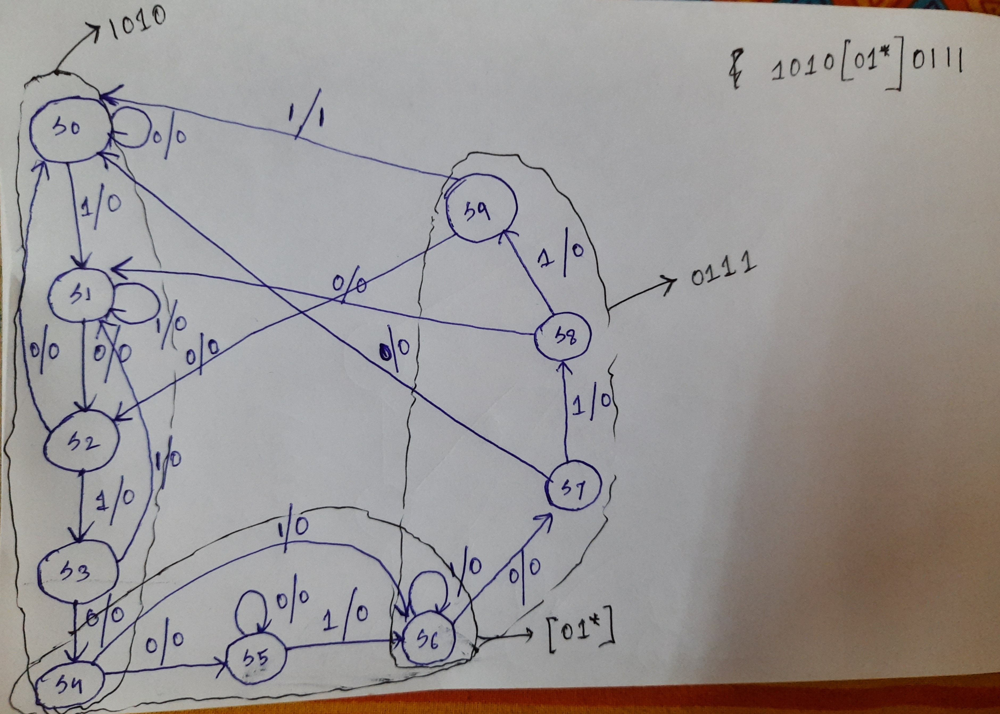
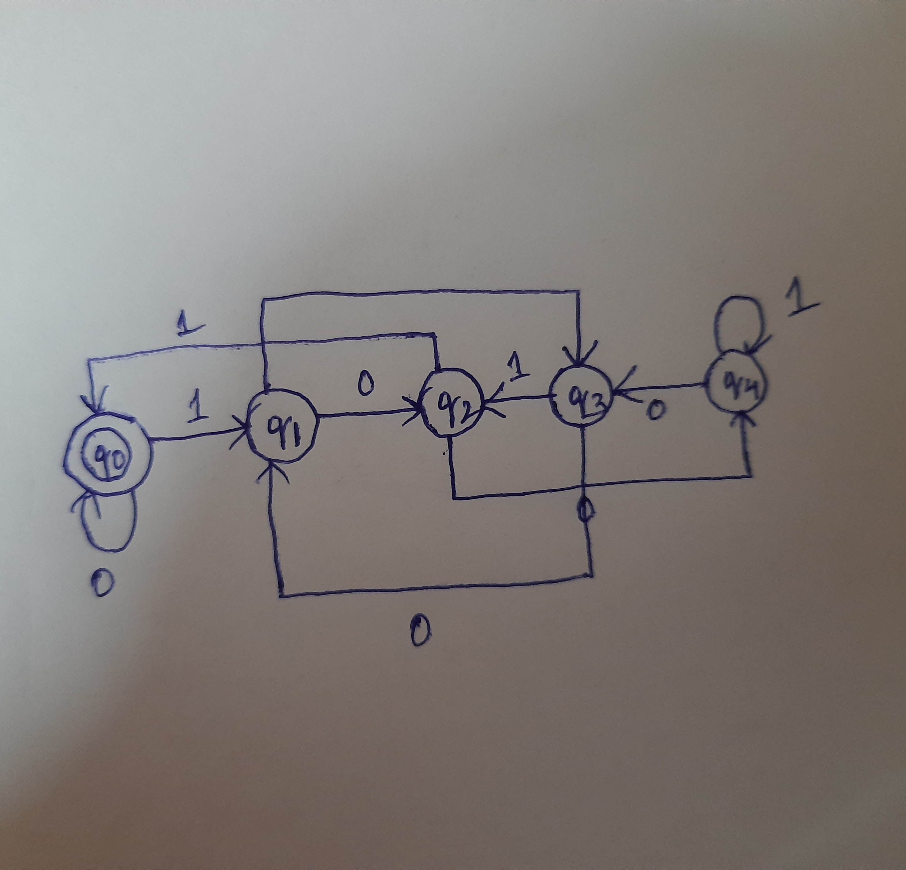

## Verilog famous questions

```md
---
Q1: Difference b/w blocking and non-blocking statements 
---
```
```cpp
//Example1
module blocking_ff(clk, a, b);

input clk;
input a;
output b;
reg c;
always_ff@(posedge clk)
begin
 c = a; //RHS will be evaluated in active region and LHS will be updated in active region. So c will get value a as well as b will also get value c sequentially but change of values will be reflected then and there in active region only. Their values will get reflected if printed by system task $display or $strobe. It will synthesize to only 1 flip-flop with a as input and b=c as output wire with "clk" as clock of the flip-flop
 b = c;
end
endmodule
```
```
In first case, blocking assignments are used and hence the value of a will be assigned to c and the new value will be reflected onto b in same cycle and hence the variable c and b results in a wire. So, only one flip flop will be needed.
```
```cpp
//Example1
module non_blocking_ff(clk, a, b);

input clk;
input a;
output b;
reg c;
always_ff@(posedge clk)
begin
 c <= a;//RHS will be evaluated in active region and LHS will be updated in NBA region. So c will get value of a, and b will get value of c
 //Their values will be reflected if they are printed by system task $strobe which occurs at the NBA region. 
 //It will synthesize to 2 f/fs - 1st flop with i/p as a and o/p as c
 //2nd flop with i/p as c and o/p as b, both clocked by the same clock "clk"
 b <= c; 
 //This is also the way for addition of pipeline registers where we put registers or f/fs in critical path i.e., longest combinational loop to break it down into shorter sequential paths
end
endmodule
```
```
In second case, old value of c is sampled before the new value is reflected in each cycle. Hence value of a reflects to b only in 2 cycles, resulting in two flip-flops.
```
```cpp
//Example2
module blocking_ff(clk, a, b, z);

input clk;
input a,b;
output z;
reg x,y;
always_ff@(posedge clk)
begin
 x = a|b;
 y = a&b;
 z = x|y;
end
```
```
In this example, each statement uses blocking assignments and the values of a and b are evaluated and assigned to x and y immediately as the statements execute in order. Hence, in third statement, the new values of x and y are evaluated and assigned to z.

Thus blocking statement are executed in the active region of Verilog Stratified Event Queue.
```
```cpp
//Example2
module non_blocking_ff(clk, a, b, z);

input clk;
input a,b;
output z;
reg x,y;
always_ff@(posedge clk)
begin
 x <= a|b;
 y <= a&b;
 z <= x|y;
end
endmodule
```
```
In nonblocking assignments, all assignments are deferred until end of current simulation tick. Hence, evaluation of entire RHS (Right hand side) happens first and only then assignment to LHS happens.

In this example, the RHS of each of the three statements are evaluated first and only after that the assignments to each of LHS (Left hand side) happens. Hence, you can notice that in this case, the old values of x and y are OR’ed and assigned to z.

Thus evaluation of RHS of Nonblocking statement occurred in Active Region and updation of LHS side happen in NBA region.
```
```md
---
Q2: Frequency divider or clock divider by 2
---
```

```md
For the circuit-

We make a flip-flop with input d and output q and ~q clocked by clock "clk"
The input clk needs to be divided by 2 , So if you connect output ~q with input d then the normal output q will act as your divided_by_2 clock
```
```cpp
module freq_divider_by_2(rst, clk, clk_by_2);

input rst;
input clk;
output reg clk_by_2;

//q = clk_by_2
//~q = ~clk_by_2

always_ff@(posedge clk)
begin
if(rst)//high active rst (say)
clk_by_2 <= 1'b0;
else
clk_by_2 <= ~clk_by_2; //connect the q~ to d
end

endmodule
```              
```md
Q2 (contd.): Can you give a general solution of the above where clock will be divided by 2N where N belongs to any +ve integer
---
```
```
Sol: We can maintain a count of every posedge of input clock.
Once it reaches the count N we can invert the output clock.
```

```cpp

//We create a module which will divide the input clock by 2*N

module clk_by_2N
#
( 
    parameter N = 6, //(In this case 2*6 = 12--> 1/12 divider)
    parameter WIDTH = $ceil($clog2(N)) + 1
)

(
    rst,
    clk,
    clk_by_2N
);

input  rst;
input  clk;
output clk_by_2N;

reg  [WIDTH - 1:0] now;
wire [WIDTH - 1:0] next;

reg clk_out;

always@(posedge clk)begin//always
if(rst)
begin
now <= 0;
clk_out <= 0;
end

else if(next == N)
begin
now <= 0;
clk_out <= ~clk_out;
end

else
now <= next;


end//always

assign next = now + 1;
assign clk_by_2N = clk_out;

endmodule : clk_by_2N
```

```
Q3: Draw a state machine for a sequence detector which can detect the pattern 1010 [01*] 0111

Here [01*] means that any number of 0s followed by any number of 1s
eg., 00..1, 0111.., 01, 001, 011, 1, 1.., 11 etc., 
---
```
```md
*Disclaimer- I have not faced this type of question before where sequence can be multiple combinations - So please do point out if you see any flaw or states that have not been considered*
*Error Note- In figure below, transition should be from S8 to --> S2 (0/0) !!!*
```


#### State Diagram



```cpp

module sd1010_any0any1_0111_mealy
(
    clk,
    reset,
    data_in,
    data_out
);

input clk;
input reset;
input data_in;
output data_out;

typedef enum logic[3:0] 
{
    IDLE = 0
    S0 = 1, 
    S1 = 2,
    S2 = 3,
    S3 = 4,
    S4 = 5,
    S5 = 6,
    S6 = 7,
    S7 = 8,
    S8 = 9,
    S9 = 10
}
state_t;

(* fsm_encoding = "grey" *)    state_t current_state;
(* fsm_encoding = "grey" *)    state_t next_state;

//Automatically synthesis tool will encode states into optimized grey encoding format

//Current state logic (sequential)

always_ff @ (posedge clk, posedge reset)
begin//
if(reset)
    current_state <= IDLE;
else
    current_state <= next_state;
end//

//Next state logic (combinational)

always_comb

begin//

next_state = current_state; //default is to stay in current state

unique_case (current_state) //Unique case is recommended so as to not infer nested MUX in synthesis
    
    IDLE :  ( data_in) ? next_state = S0 : IDLE  ;
    
    S0   :  ( data_in) ? next_state = S1 : S0    ;
    S1   :  (!data_in) ? next_state = S2 : S1    ;
    S2   :  ( data_in) ? next_state = S3 : S0    ;
    S3   :  (!data_in) ? next_state = S4 : S1    ;

    S4   :  (!data_in) ? next_state = S5 : S6    ;
    S5   :  ( data_in) ? next_state = S6 : S5    ;
    
    S6   :  (!data_in) ? next_state = S7 : S6    ;
    S7   :  ( data_in) ? next_state = S8 : S0    ;
    S8   :  ( data_in) ? next_state = S9 : S2    ; //010 is encountered upto this, so expecting a 10 for overlapped case. Jump to S2 --> In figure transition should be S8 --> S2 (0/0) !
    S9   :  ( data_in) ? next_state = S0 : S2    ; //0110 is encountered upto this, so expecting a 10 for overlapped case. Jump to S2

endcase

end//

//Output assignment
assign data_out = (current_state == S9) ? 1 : 0;

endmodule


```

```md

Q4: Why there is no XNAND or XAND gates when there is XNOR or XOR gates

**Disclaimer-This is the one of the weirdest question I have faced ever. I seriously don't know the answer, and also don't want to know. Though if you find the right answer, ping me the answer. For now I am giving the answer which I found on the internet** 

```
```md
XOR is synonymous to XNAND
XNOR is synomymous to XAND

So XNAND and XAND gates are redundant as is this question :)
```
```md
---
Q5: Write a FSM to detect a binary number which is divisible by 5 and also extract a general mathematical equation to generate the next state
--- 
```
```md
**General Solution-**
- A general algorithm to create an FSM to check divisibility by a number N is as follows:
1) Create N states and number them from 0 to N-1. The number on the state denotes the remainder of a number when divided by N i.e., a (mod N) where a is the number
2) For each state i, there are two arrows going out: one for 0, the other for 1. The arrow for 0 goes to state 2i (mod N), and that for 1 goes to 2i + 1 (mod N).
i.e., Qi -> Q(2*i + transition) mod N, where transition can be inside {0,1}

```
```md
Now coming to our solution
N = 5
So, We will have states Q0, Q1, Q2, Q3, Q4
States |  Description
Q0    -> remainder is 0 when divided by 5 (this will be our starting and desired finishing state)
Q1    -> remainder is 1 when divided by 5
Q2    -> remainder is 2 when divided by 5
Q3    -> remainder is 3 when divided by 5
Q4    -> remainder is 4 when divided by 5

Now coming to the transitions

- When in state Q0, 
if we encounter a 0, goto 0*2(mod 5) i.e., Q0
if we encounter a 1, goto 0*2+1(mod 5) i.e., Q1

- When in state Q1,
if we encounter a 0, goto 1*2(mod 5) i.e., Q2
else if we encounter a 1, goto 1*2+1(mod 5) i.e., Q3

- When in state Q2,
if we encounter a 0, goto 2*2(mod 5) i.e., Q4
else if we encounter a 1, goto 2*2+1(mod 5) = 5(mod 5) = 0(mod 5) i.e., Q0

- When in state Q3,
if we encounter a 0, goto 2*3(mod 5) = 6(mod 5) = 1(mod 5) i.e., Q1
else if we envounter a 1, goto 2*3+1(mod 5) = 7(mod 5) = 2(mod 5) i.e., Q2

- When in state Q4,
if we encounter a 0, goto 2*4(mod 5) = 8(mod 5) = 3(mod 5) i.e., Q3
else if we encounter a 1, goto 2*4+1(mod 5) = 9(mod 5) = 4(mod 5) i.e., Q4

Now the outputs corresponding to all the states is 0 except Q0.

So we want a transition that starts from Q0 and ends at Q0 

```
#### State Diagram


```
The doubled circled state is the one having output as 1

Let’s take 5 for example. Its binary representation is 101. Following the graph, you can tell 101 goes through the path q0 → q1 → q2 → q0. It starts from q0 and ends in q0, and indeed 5 is divisible by 5!

You can check for others...
```

```cpp
module div_by_5_det_mealy
(
    clk,
    reset,
    data_in,
    data_out
);

input clk;
input reset;
input data_in;
output data_out;

typedef enum logic[2:0]
{   
    IDLE = 0,
    S0 = 1,
    S1 = 2,
    S2 = 3,
    S3 = 4
}
state_t;

(* fsm_encoding = "grey" *) state_t current_state;
(* fsm_encoding = "grey" *) state_t next_state;

//Automatically synthesis tool will encode states into optimized grey encoding format

//Current state logic (sequential)

always_ff@(posedge clk, posedge reset)
begin//
if(reset)
    current_state <= IDLE;
else
    current_state <= next_state;
end//

//Next state logic (combinational)

always_comb

begin//

next_state = current_state; //default is to stay in current state

unique_case(current_state)

    IDLE : ( data_in) ? next_state = S0 : IDLE;

    S0   : (!data_in) ? next_state = S0 : S1;
    S1   : (!data_in) ? next_state = S2 : S3;
    S2   : (!data_in) ? next_state = S4 : S0;
    S3   : (!data_in) ? next_state = S1 : S2;
    S4   : (!data_in) ? next_state = S3 : S4;

endcase

end//

//Output assignment

assign data_out = (current_state == S0) ? 1 : 0;

endmodule
```

```md
Q6: Write a verilog code to swap contents of 2 registers
```
```cpp
//Using temporary variable

reg clk;
reg [3:0] temp;
reg [3:0] a;
reg [3:0] b;

always_ff@(posedge clk)
begin//
temp = b;
b = a;
a = temp;
end//
```
```cpp
//Without using temporary variable
reg clk;
reg [3:0] a;
reg [3:0] b;

always_ff@(posedge clk)
begin//
a = a^b;
b = a^b;
a = a^b;
end//
```
```cpp
//Without using temporary variable leveraging non-blocking operation in verilog

//In first clock, swap happens provided a, b are initialised to desired values, in the next clock it becomes same again

reg clk;
reg [3:0] a;
reg [3:0] b;

always_ff@(posedge clk)
begin//
a <= b;
b <= a;
end//
```