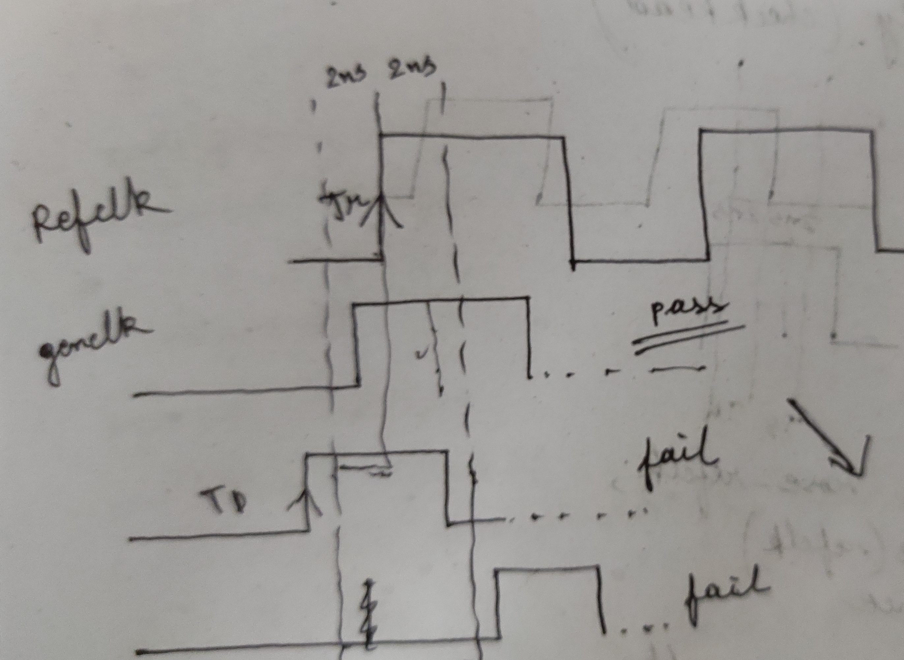

## Some Common Assertion Questions 

```md
---
Q1: There are 2 signals x_sig and y_sig. On next clock of x_sig we should get y_sig.
Write an assertion and also a cover property for the same. The assertion should be disabled when rst_n is high.
---
```
```cpp
property y_after_x(x_sig, y_sig);
@(posedge clk) disable iff (!rst_n)
x_sig |-> ##1 y_sig;
endproperty

Y_AFTER_X_ASSERT: assert property (y_after_x(x_sig, y_sig))
else
$error("Error");

Y_AFTER_X_COVER: cover property (y_after_x(x_sig, y_sig))

```
```md
---
Q2: Signal x should remain high or stable until signal y is asserted. Write a property or assertion.
---
```
```cpp
property a_o(x,y);
@(posedge clk)
(x && !y) |-> (x throughout y[->1]); //x should remain high until 1st occurence of y becoming high
endproperty

property a_o(x,y);
@(posedge clk)
x |-> $stable(x)[*1:$] ##0 y; //x should remain stable until y arrives
endproperty
```

          
```md
---
Q3: Write an assertion or property to check if signal y is reflected upon signal x immediately
---
```
```cpp

property x_equal_y;
@(posedge clk)
1 |-> ##[0:$] (x == y);
endproperty

```

```md
---
Q4: Write a macro to force and release a source signal and check if it is getting reflected in the destination signal.
(A connectivity checker which can be used to increase toggle coverage)
---
```


```cpp

`define CONNECTIVITY_CHECK (x)  \
#100ns; \
force ``x = 1; \
#200ns;  \
release ``x;  \
#200ns; \
force ``x = 0; \
#200ns; \
release ``x; \
#400ns;

`CONNECTIVITY_CHECK(tb.dut.a);

```

```md
---
Q4: Write a macro to check if signal y is getting reflected in signal x immediately
---
```
```cpp

`define X_EQ_Y (source, destination, id) \

``id``_assert: assert (``source === ``destination) else $error("Error");
```
```md
---
Q5: Write a property/assertion to check if signal is toggling
---
```

```cpp
property sig_toggle;
realtime first_change;
@(sig)
(1, first_change = $realtime) => 0; //at change in signal sig store the time in a local variable and indicate a hard failure at the consequent
endproperty
```


```md
---
Q6: Write an assertion to check glitch in a signal.
---
```
```cpp
property glitch(sig);
realtime first_change;
@(sig)
(1, first_change = $realtime) |=> ($realtime - first_change) >= 2ns; //Let's say period between 0->1 and 1->0 should not be less than 2ns 
endproperty
```

```md
---
Q7: Write an assertion to check clock gating
---
```
```md

Let's say there are 2 inputs "clk_in" and "gate" to a logic gate and output is "clk_out"
When gate == 0; clk_out = clk_in;
When gate == 1; clk_out = 0; i.e., gated
 
```
```cpp
//Lets make a reference clock from our clk_in

logic clk_in = 0;
logic clk_ref, clk_out, gate;
initial
forever #100 clk_in = !clk_in;
assign  #10 clk_ref = clk_in;

//2 properties will be there , one for gate = 1 and another for gate = 0

//gate = 1
property gate_1;
@(posedge clk_ref)
$rose(gate) ##0 clk_out === 0 |-> (clk_out===0 throughout !gate[->1]);
endproperty

//gate = 0
task automatic gate_0_task();
while(gate == 0)
@(posedge clk_ref or negedge clk_ref)
assert (clk_out == clk_in);
endtask

property gate_0;
@(posedge clk_ref)
$fell(gate) |-> (1, gate_0_task());
endproperty
```
```md
---
Q7: Write an assertion/property to check time period of a signal
---
```
```cpp
//Make use of local variables !

property p_check;

realtime current_time;
realtime difference;

(1, current_time = $realtime) //Store the time in current time variable at 1st change
##1 //One change later
(1, difference = $realtime - current_time) //store the difference of current time to previous time in a variable
##0 //At same time
difference == 10ns; //check the difference to be half clock period; say 10ns

endproperty

check_period_10: assert property (@posedge(clk) p_check);
```
```md
---
Q7: Write an inbuilt verilog timing check to constrain genclock, such that "genclock" cannot [0->1] with the [0->1] of "refclk" within a specified time window  
---
```

```md
So from figure TD - TR > (TP/2 = 2ns)
Verilog has a inbuilt check for this 
```
```cpp
module
...
specify
$skew(posedge refclk, posedge genclk, 2ns);
endspecify
...
endmodule
```

```md
---
Q7: Write a property/assertion for I2C protocol to check SDA remaining stable during the high period of SCL  
---
```
```cpp

reg high_freq_clk;
initial
high_freq_clk = 0;
forever
#1ps high_freq_clk = !high_freq_clk;
 //make a free running fast clock
property SDA_STABLE_WHILE_SCL_HIGH;
@(posedge high_freq_clk) disable iff (scl === 0 || intf.start === 1 || intf.stop === 1 || intf.idle === 1)
(scl===1) |->  sda === $past(sda) throughout !(scl[->1]); //SDA remains wholly 1 or 0 until SCL becomes 0,.i.e., no glitch in SDA
endproperty

A0_ASSERT : assert property (SDA_STABLE_WHILE_SCL_HIGH);
```

```md
---
Q8: Write an property to check if signal "x" is equal to previous "x", signal y would be 0 
---
```

```cpp
property check_1;
$past(x) === (x) |-> ! y;
endproperty

check_1_1: assert property (@posedge(clk) check_1);
```

```md
---
Q9: Write an property to check if signal "y" is asserted only when input edge is detected in signal x   
---
```

```cpp
property check_2;
y |-> $past(x) !== (x);
endproperty

check_2_2: assert property (@posedge(clk) check_2);
```
```md
---
Q10: Check that "writedata" should not go to unknown when "write_enable" becomes 0   
---
```

```cpp
property checkwrData;
@(posedge clk)
$fell(write_enable) |-> not($isunknown(writedata)); //writedata cannot go to unknown when write_enable falls to 0
endproperty
```

```md
---
Q11: Make sure FSM does not get stuck in current State except 'IDLE'   
---
```

```cpp
property StuckState;
@(posedge clk) disable iff(rst)
( current_state !== IDLE && $stable(current_state) ) [*64] |=> 0; //If current state is not Idle and it is stuck for 64 clock cycles indicate a hard failure
endproperty

```

```md
---
Q12: Make sure signal toggles in the pattern "010101..." or "101010..."   
---
```

```cpp
assert property ( @(posedge clk) ##1 $changed(signal) ); //For every clock, in the next clock edge signal value should be opposite to previous clock edge
```
