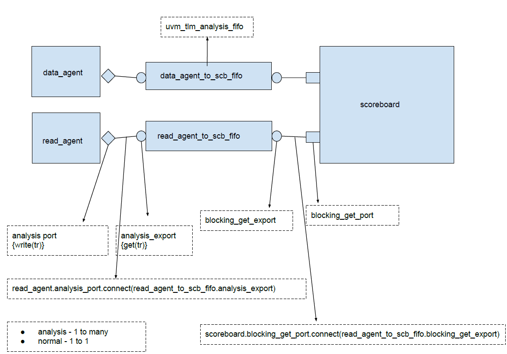

## Coding Scenario 1


#### Question 1
```md
---
Q1: Write the RTL code for a simple synchronous FIFO and also write a basic UVM testbench for it
---
```
```cpp
//RTL Code for synchronous FIFO
module sync_fifo (clk, rst, wdata, rdata, wr_en, rd_en, full, empty);

//parameters

    parameter DATA_WIDTH = 8;
    parameter DEPTH = 32;
    parameter ADDR_WIDTH = $clog2(DEPTH)+1; //+1 for overflow because 100000 is 32

//inp-oup port decl

	input clk;
	input rst;
	input  [DATA_WIDTH - 1:0] wdata;
	input wr_en;
	input rd_en;

	output [DATA_WIDTH - 1:0] rdata;
	output full;
	output empty;


//Internal registers

	reg [ADDR_WIDTH - 1:0] wr_pt;
	reg [ADDR_WIDTH - 1:0] rd_pt;
    reg [DATA_WIDTH - 1:0] rdata_temp;

//Memory 
	reg [DATA_WIDTH - 1:0] mem [DEPTH - 1:0];

	integer i;

//Init mem when reset
	
	always_ff@(posedge clk, posedge rst)
        begin//
            if(rst)begin
            for(i=0; i<DEPTH;i++)
                mem[i] <= 0;
            end
        end//

//Write to Fifo
    always_ff@(posedge clk, posedge rst)
	    begin
	        if(wr_en && ~full)
		        mem[wr_pt] <= wdata;
	    end

//Default val of read data when reset
    always_ff@(posedge clk, posedge rst)
        begin
	        if(rst)
                rdata <= 0;
	    end


//Read from Fifo
    always_ff@(posedge clk, posedge rst)
	    begin
	        if(rd_en && ~empty)
                rdata_temp <= mem[rd_pt];
        end

//Maintain the wr pointer
    always_ff@(posedge clk, posedge rst)
	    begin
	        if(rst)
		        wr_pt <= 0;
	       else if (wr_en && ~(full))
		        wr_pt <= wr_pt + 1;
        end

//Maintain the rd pointer
      always_ff@(posedge clk, posedge rst)
        begin
            if(rst)
                rd_pt <= 0;
            else if (rd_en && ~(empty))
                rd_pt <= rd_pt + 1;
	    end

//Continuous assignments
       assign empty =  (rd_pt == wr_pt);
       assign full  =  ((wr_pt[ADDR_WIDTH-1] != rd_pt[ADDR_WIDTH-1]) && (wr_pt[ADDR_WIDTH-2:0] == rd_pt[ADDR_WIDTH-2:0]));
      
       assign rdata = rdata_temp;

endmodule


////  1 wr at 0th loc wdata wr_pt = 1
////  1 rd at 0th loc rdata rd_pt = 1 --> empty signal goes high
////  32 wr at 0-31th locs wdata wr_pt = 1 00000 & rd_pt = 0 00000 --> full signal goes high 

```

```cpp
//Definitions regarding RTL

/**********************************
* definitions (file name - vip.svh)
***********************************/

`ifndef VIP_DEF
`define VIP_DEF

`define DATA_WIDTH 8
`define DEPTH 32
`define ADDR_WIDTH 5
`endif
```

```cpp
/***********************************
* data_transaction (file name - data_transaction.sv)
************************************/

class data_transaction extends uvm_sequence_item;
        
        //Items
    rand logic [`DATA_WIDTH - 1:0] wdata;
    rand logic wr_en;
    rand logic rd_en;

    function new(string name = "data_transaction");
    super.new(name);
    endfunction 
    
    `uvm_object_utils_begin(data_transaction)
    `uvm_field_int(wdata, UVM_ALL_ON)
    `uvm_field_int(wr_en, UVM_ALL_ON)
    `uvm_field_int(rd_en, UVM_ALL_ON)
    `uvm_object_utils_end

endclass
```

```cpp
/************************************
* rst_transaction (file name - rst_transaction.sv)
*************************************/

class rst_transaction extends uvm_sequence_item;

    //Items
    logic rst;
    
    function new (string name = "rst_transaction");
    super.new(name);
    endfunction
    
    `uvm_object_utils_begin(rst_transaction)
    `uvm_field_int(rst, UVM_ALL_ON)
    `uvm_object_utils_end

endclass
```
```cpp
/***************************************
* Write to the fifo from empty->full and read from fifo from full->empty
* fifo_test_1_seq (file name - fifo_test_1_seq.sv)
***************************************/

class fifo_test_1_seq extends uvm_sequence #(data_transaction);

	//Register with factory
	
	`uvm_object_utils(fifo_test_1_seq)
	
	//create tx handle
         
	data_transaction tr;
	
	//new func
	
	function new(string name = "fifo_test_1_seq");
	super.new(name);
	endfunction
	
	//task

	virtual task body();
	
	for(int i = 0; i < 80; i++)begin
	//create 80 packets
	tr = data_transaction::type_id::create("tr");
	
	//start the items
	start_item(tr);
        
	if(i<40)begin//
	
	//40 writes
	if( !tr.randomize() with {tr.wr_en == 1'b1;  tr.rd_en == 1'b0;} )begin
	`uvm_error("fifo_test_1_seq", "write tx randomization failed")
	end
	
	end//
	
	else begin//
	
	//40 reads
	if( !tr.randomize() with {tr.wr_en == 1'b0; tr.rd_en == 1'b1;} )begin
	`uvm_error("fifo_test_1_seq", "read tx randmization failed")
	end
	 
	end//
	
	//finish the item
	finish_item(tr);
	
	end 
	
	endtask
endclass

```

```cpp
/*******************************
* write the fifo from empty-->half_full and then do write/read at same time
* fifo_test_2_seq (file name - fifo_test_2_seq.sv)
*******************************/

class fifo_test_2_seq extends uvm_sequence#(data_transaction);

	//Register with factory
	`uvm_object_utils(fifo_test_2_seq)

	//take tx handle
	data_transaction tr;
	
	//new function
	function new(string name = "fifo_test_2_seq");
	super.new(name)
	endfunction

	virtual task body();
	
	//40 packets in total
	for(int i=0; i<40; i++)begin///
	tr = data_transaction::type_id::create("tr");
	
	//start the item
	start_item(tr);
	
	//To make it half full we can write 16 loc
        if (i < 16)begin//
	if ( !tr.randomize() with {tr.wr_en == 1'b1; tr.rd_en == 1'b0;} ) begin
	`uvm_error("fifo_test_2_seq", "write tx randomization failed")
        end
	end//
	else begin//
	 if( !tr.randomize() with {tr.wr_en == 1'b1; tr.rd_en == 1'b1;} )begin
	 `uvm_error("fifo_test_2_seq", "write_read tx randomization failed")
	 end
	end//

        //finish the item
	finish_item(tr);
	end///

    endtask

endclass

```

```cpp
/**********************************
* first send rst_transaction with rst = 1 and next send rst_transaction with rst = 0
* fifo_rst_seq (file name - fifo_rst_seq.sv)
**********************************/

class fifo_rst_seq extends uvm_sequence #(rst_transaction);

	//register with factory
	`uvm_object_utils(fifo_rst_seq)

	//rst tx handle
	rst_transaction tr;

	//new func
	function new(string name = "fifo_rst_seq");
	super.new(name);
	endfunction

	//task
	virtual task body();
	
	//send rst_tx with rst = 1
	tr = rst_transaction::type_id::create("tr");
        start_item(tr);
	tr.rst = 1'b1;
	finish_item(tr);

        //send rst_tx with rst = 0
	tr = rst_transaction::type_id::create("tr");
	start_item(tr);
	tr.rst = 1'b0;
	finish_item(tr);

	endtask

endclass
```
```cpp
/***********************************
* data_seqr
* data_seqr (file name - data_seqr.sv)
***********************************/

class data_seqr extends uvm_sequencer# (data_transaction);

	//register with factory
	`uvm_component_utils(data_seqr)

	//new func
	function new(string name, uvm_component parent);
	super.new(name, parent);
	endfunction

endclass
```
```cpp
/***********************************
* rst_seqr
* rst_seqr (file name - rst_seqr.sv)
***********************************/

class rst_seqr extends uvm_sequencer #(rst_transaction);
	
	//register with factory
	`uvm_component_utils(rst_seqr)

	//new func
	function new(string name, uvm_component parent);
	super.new(name,parent);
	endfunction

endclass

```
```cpp
/**********************************
* top_vseq_base(top base virtual sequence)
* top_vseq_base (file name - top_vseq_base.sv)
**********************************/

class top_vseq_base extends uvm_sequence #(uvm_sequence_item)

	//register with factory
	`uvm_object_utils(top_vseq_base)
        
	//take child seqrs handles
	data_seqr data_seqr_h;
	rst_seqr rst_seqr_h;

	//function new
	function new(string name = "top_vseq_base");
	super.new(name);
	endfunction

endclass
```
```cpp
/**********************************
* vseq_rst_data (top virtual sequence which will do rst --> data tx)
* (file name - vseq_rst_data.sv)
**********************************/

class vseq_rst_data extends top_vseq_base;

	//register with factory
	`uvm_object_utils(vseq_rst_data)

	//take seqs handles
	
	fifo_rst_seq rst_seq_h;
	fifo_test_1_seq test_1_seq_h;

	//function new
	function new(string name = "vseq_rst_data");
	super.new(name);
	endfunction

	virtual task body();
	
	//create seqs
	rst_seq_h = fifo_rst_seq :: type_id :: create("rst_seq_h");
	test_1_seq_h = fifo_test_1_seq :: type_id :: create("test_1_seq_h");

	fork
		rst_seq_h.start(rst_seqr_h);
		test_1_seq_h.start(data_seqr_h);
	join  
	
	endtask

endclass
```
```cpp
/**********************************
* dut_if - i/f which connects dut pins with vip
* (file name - dut_if.sv)
**********************************/

interface dut_if;
	
	//ip items to dut
	logic clk;
	logic rst;
	logic  [`DATA_WIDTH - 1:0] wdata;
	logic wr_en;
	logic rd_en;
        
	//op items from dut
	logic [`DATA_WIDTH - 1:0] rdata;
	logic full;
	logic empty;

endinterface
```
```cpp
/*********************************
* data_drv - driver for driving data tx
* (file name- data_drv.sv)
*********************************/

class data_drv extends uvm_driver #(data_transaction);

	//register with the factory
	`uvm_component_utils(data_drv)

	//data_tx handle create
	data_transaction tr;

	//take a virtual intf(logical intf) which is of the same type as actual physical intf
	virtual dut_if data_drvr_to_dut_if;

	//new func
	function new (string name, uvm_component parent);
	super.new(name, parent);
	endfunction

	///build phase
	//get the pointer to actual physical intf and assign it to local logical intf handle
   	virtual function void build_phase(uvm_phase phase);
	super.build_phase(phase);
	 if (! uvm_config_db #(virtual dut_if) :: get(this, "", "dut_if", data_drvr_to_dut_if) ) 
		
		//this - get the intf in this component
		//"" - if we are passing this as 1st arg, so need to spread this config to elsewhere so 2nd arg is ""
		//"dut_if" - string with which the actual intf has been stored in database , so it acts like key
		//data_drvr_to_dut_if - so whatever intf instance get call gives us we will assign it to local logical handle "data_drvr_to_dut_if" 
		
		`uvm_info ( "data_drv" , "data_drv failed to get dut_if" , UVM_HIGH)
		
		//UVM_NONE=0
		//UVM_LOW=100
		//UVM_MEDIUM=200
		//UVM_HIGH=300
		//UVM_FULL=400
		//UVM_DEBUG=500

        //Since verbosity is passed as UVM_HIGH so this message will be printed once condition matches only if 
		//"UVM_HIGH" or "UVM_FULL" or "UVM_DEBUG" is passed from command line as log verbosity. 
		//Default log verbosity if nothing is set is "UVM_MEDIUM" 
	 
	endfunction 

	//Task for checking if reset is on and then sending appropriate wr_en & rd_en
	task reset_check();
	
	forever begin
		@(posedge data_drvr_to_dut_if.clk)
			if(data_drvr_to_dut_if.rst)
				begin
				data_drvr_to_dut_if.wr_en = 1'b0;
				data_drvr_to_dut_if.rd_en = 1'b0;
				end
	end
	
	endtask :: reset_check
	
 
	//Task for checking once reset ends , then send valid data tx
	
	task data_send();

	forever begin
		@(posedge data_drvr_to_dut_if.clk)
			if(!data_drvr_to_dut_if.rst)
			begin
			seq_item_port.get_next_item(tr);
			#1; //since these tasks are called in parallel so no time in b/w. -->so #1 delay
			data_drvr_to_dut_if.wr_en = tr.wr_en;
			data_drvr_to_dut_if.rd_en = tr.rd_en;
			data_drvr_to_dut_if.wdata = tr.wdata;
			seq_item_port.item_done();
			end
	end
	
	endtask :: data_send()

	virtual task run_phase(uvm_phase phase);

	fork
		reset_check(); 
		data_send();
	join

	endtask

endclass

```

```cpp
/******************************
rst_drv - driver for driving rst tx
(file name - rst_drv.sv)
******************************/

class rst_drv extends uvm_driver #(rst_transaction);
        
	//register with factory
	`uvm_component_utils(rst_drv)
	
	//take handle of rst tx
	rst_transaction tr;

        //take the instance of logical or virtual intf of type actual intf
	virtual dut_if rst_drvr_to_dut_if;

	//new func
	function new(string name, uvm_component parent);
	super.new(name,parent);
	endfunction

	//build phase
	virtual function void build_phase(uvm_phase phase);
        super.build_phase(phase);
        //Get the pointer to actual physical intf and assign to local virtual/logical intf handle "rst_drvr_to_dut_if"
	if ( !uvm_config_db# (virtual dut_if) :: get( this, "", "dut_if", rst_drvr_to_dut_if) )
		`uvm_info("rst_drv", "rst_drv failed to get the dut_intf", UVM_HIGH);
	endfunction

	virtual task run_phase(uvm_phase phase);

	seq_item_port.get_next_item(tr);
	rst_drvr_to_dut_if.rst = tr.rst;
	repeat(3) @(negedge rst_drvr_to_dut_if.clk) 
	//keep the reset on for 3 clocks --> why negedge --> so that data_drv can start driving data at next posedge of clk
	seq_item_port.item_done();

	seq_item_port.get_next_item(tr);
	rst_drvr_to_dut_if.rst = tr.rst;
	seq_item_port.item_done();
	
	endtask

endclass
```
```cpp
/********************************
* write_monitor -- broadcasting the data tx to scoreboard when there is fifo write
* (file name - write_monitor.sv)
********************************/

class write_monitor extends uvm_monitor;
	
	//register with factory
	`uvm_component_utils(write_monitor)

	//take the data tx handle
	data_transaction tr;
	
	//take analysis port
	uvm_analysis_port #(data_transaction) write_monitor_ap;

	//take a virtual/logical intf handle
	virtual dut_if dut_if_to_write_mon;

	//new func
	function new(string name, uvm_component parent);
	super.new(name, parent);
	endfunction

	//build phase
	virtual function void build_phase(uvm_phase phase);
	super.build_phase(phase);

	//create the analysis port
	//since it is a tlm port, create cannot be used, instead new will be used
	write_monitor_ap = new("write_monitor_ap", this);
	
	//try to get pointer to actual intf through config_db and assign it to logical/virtual intf
	if (! uvm_config_db #(virtual dut_if) :: get (this, "", "dut_if", dut_if_to_write_mon) )
		`uvm_info("write_monitor" , "write_monitor failed to get pointer to dut_if", UVM_NONE)

	endfunction

	virtual task run_phase(uvm_phase phase);
	
	forever begin
		@(posedge dut_if_to_write_mon.clk)
	
		//create 1 empty transaction
		tr = data_transaction :: type_id :: create("tr");
			if(dut_if_to_write_mon.rst === 1'b0 && dut_if_to_write_mon.wr_en === 1'b1 && dut_if_to_write_mon.full === 1'b0)
			begin
				tr.wdata = dut_if_to_data_mon.wdata;
				write_monitor_ap.write(tr);
			end
        end
	endtask

endclass
```
```cpp
/**************************************
* read_monitor - broadcasting the data tx to scoreboard when there is a fifo read
* (file name - read_monitor.sv)
**************************************/

class read_monitor extends uvm_monitor;

	//register with factory
	`uvm_component_utils(read_monitor)

	//take the data tx handle
	data_transaction tr;

	//take virtual/logical intf handle
	virtual dut_if dut_if_to_read_mon;

	//take analysis port instance
	uvm_analysis port #(data_transaction) read_monitor_ap;

	//new func
	function new(string name, uvm_component parent);
	super.new(name, parent);
	endfunction

	//build phase
	virual function void build_phase(uvm_phase phase);
	super.build_phase(phase);

	//create the analysis port instance with new
	read_monitor_ap = new("read_monitor_ap", this);
	
	//try to get the pointer to actual intf through config_db and put it to local/logical/virtual intf
	if (! uvm_config_db #(virtual dut_if) :: get( this, "", "dut_if", dut_if_to_read_mon) )
		`uvm_info("read_monitor", "read_monitor failed to get dut_if", UVM_NONE)
	endfunction

	virtual task run_phase(uvm_phase phase);
	
	forever begin
		@(posedge dut_if_to_read_mon.clk)
			//create empty transaction
			tr = data_transaction :: type_id :: create("tr");
		if (dut_if_to_read_mon.rst === 1'b0 && dut_if_to_read_mon.rd_en === 1'b1 && dut_if_to_read_mon.empty === 1'b0)
			begin
				tr.rdata  = dut_if_to_read_mon.rdata
				read_monitor_ap.write(tr);
			end
	end

	endtask

endclass
```
```cpp
/*************************************
* data_agent - it contains data drver, data seqr, write monitor. It is an active agent which is having all the components within it
* (file name - data_agent.sv)
*************************************/

class data_agent extends uvm_component;

	//register with factory
	`uvm_component_utils(data_agent)

	//take local handle of write_monitor analysis port
	uvm_analysis_port #(data_transaction) write_monitor_ap;

	//take the drv, sqr and mon handles
	data_drv data_drv_h;
	data_seqr data_seqr_h;
	write_monitor write_monitor_h;

	//new func
	function new(string name, uvm_component parent);
	super.new(name,parent);
	endfunction

	//build phase
	virtual function void build_phase(uvm_phase phase);
	super.build_phase(phase);
	
	//create drv, seqr and mon
	data_drv_h = data_drv :: type_id :: create("data_drv_h", this);
	data_seqr_h = data_seqr :: type_id :: create("data_seqr_h", this);
	write_monitor_h = write_monitor :: type_id :: create("write_monitor_h", this);

	endfunction

	//connect phase
	virtual function void connect_phase(uvm_phase phase);
	super.connect_phase(phase);
	
	//seqr --> driver connection
        data_drv_h.seq_item_port.connect(data_seqr_h.seq_item_export);
	
	//point the local analysis port to actual monitor analysis port
	this.write_monitor_ap = write_monitor_h.write_monitor_ap;

	endfunction

endclass
```
```cpp
/************************************
* rst_agent - it contains rst_drver, rst_seqr. It is an active agent containing all components within it excluding w/r monitors, 
because at rst, w/r will not happen
* (file name - rst_agent.sv)
************************************/

class rst_agent extends uvm_component;

	//register with factory
	`uvm_component_utils(rst_agent)

	//take drv, seqr handles
	rst_drv rst_drv_h;
	rst_seqr rst_seqr_h;

	//new func
	function new(string name, uvm_component parent);
	super.new(name, parent);
	endfunction

	virtual function void build_phase(uvm_phase phase);
	super.build_phase(phase);
	
	//create the drv and seqr
	rst_drv_h = rst_drv :: type_id :: create("rst_drv_h", this);
	rst_seqr_h = rst_seqr :: type_id :: create("rst_seqr_h", this);

	endfunction

	virtual function void connect_phase(uvm_phase phase);
	super.connect_phase(phase);

	//drv --> seqr connection
	rst_drv_h.seq_item_port.connect(rst_seqr_h.seq_item_export);
	
	endfunction
endclass
```
```cpp
/************************************
* read_agent - It only contains read_monitor. So it is a passive agent just for tapping/referencing data on read path when fifo read happens
* (file name - read_agent.sv)
************************************/

class read_agent extends uvm_component;

	//register with factory
	`uvm_component_utils(read_agent)
	
	//take local analysis port pointer
	uvm_analysis_port #(data_transaction) read_monitor_ap;
	
	//take the read monitor handle
	read_monitor read_monitor_h;

	//new func
	function new(string name, uvm_component parent);
	super.new(name,parent);
	endfunction

	//build phase
	virtual function void build_phase(uvm_phase phase);
	super.build_phase(phase);

	//create the monitor instance
	read_monitor_h = read_monitor :: type_id :: create("read_monitor_h", this);

	endfunction

	//connect phase
	virtual function void connect_phase(uvm_phase phase);
	super.connect_phase(phase);
	
	//point the local analysis port to actual monitor's analysis port
	this.read_monitor_ap = read_monitor_h.read_monitor_ap;

	endfunction

endclass
```
#### Agent<-->TLM analysis fifo<-->scoreboard connection

```cpp
/*************************************
* scoreboard - scoreboard which takes in write and read data from fifo and compares them
* (file name - scoreboard.sv)
*************************************/

class scoreboard extends uvm_scoreboard;

	//register with factory
	`uvm_component_utils(scoreboard)
	
	//take 2 blocking get ports handle
	//through one port scoreboard will take actual transaction i.e., read data to fifo
	//through another port scoreboard will take expected transaction i.e., write data to fifo

	uvm_blocking_get_port #(data_transaction) actual_port;
	uvm_blocking_get_port #(data_transaction) expected_port;

	//take 2 empty handles of data_transactions
	data_transaction actual_data;
	data_transaction expected_data;
        
	//bit to check if comparison became successful or not
	bit success_or_fail;
	
	//new func
	function new(string name, uvm_component parent);
	super.new(name, parent);
	endfunction

	//build phase
	virtual function void build_phase(uvm_phase phase);
	super.build_phase(phase);
	// create the instances of the blocking get port
	actual_port = new("actual_port", this);
	expected_port = new("expected_port", this);
	endfunction

	//virtual task run_phase(uvm_phase phase);
	
	forever begin
		actual_port.get(actual_data);
		expected_port.get(expected_data);
		
		//uvm_object has many utility functions like print, copy, compare that 
		//are available to its child classes and can be used out of the box if the items 
		//of child class has used uvm_automation macros while definition 
		success_or_failure = expected_data.compare(actual_data);
		
		if (!success_or_failure) begin
		`uvm_warning("scoreboard", "comparison failed")
		`uvm_info("scoreboard", $sformatf("the expected data is \n  %s", expected_data.sprint() ), UVM_NONE)
		`uvm_info("scoreboard", $sformatf("the actual data is \n %s", actual_data.sprint() ), UVM_NONE)
		
		end
		else begin
		`uvm_info("scoreboard", "comparison successful", UVM_MEDIUM)
		end
	end

	endtask

endclass
```
```cpp
/**********************************
* env - contains all agents, tlm_fifos, scoreboard
* (file name - env.sv)
**********************************/

class env extends uvm_env;

	//register with factory
	`uvm_component_utils(env)

	//take the handles of the agents
	data_agent data_agent_h;
	rst_agent rst_agent_h;
	read_agent read_agent_h;

	//take handles of tlm_analysis_fifo
	uvm_tlm_analysis_fifo #(data_transaction) data_agent_to_scoreboard;
	uvm_tlm_analysis_fifo #(data_transaction) read_agent_to_scoreboard;

	//take the scoreboard handle
	scoreboard scoreboard_h;

	//new func
	function new(string name, uvm_component parent);
	super.new(name, parent);
	endfunction  
	
	//build phase
	virtual function void build_phase(uvm_phase phase);
	super.build_phase(phase);
	
	//create the instances of agents, tlm_analysis_fifos, scoreboard
	data_agent_h = data_agent :: type_id :: create("data_agent_h", this);
	rst_agent_h = rst_agent :: type_id :: create("rst_agent_h", this);
	read_agent_h = read_agent :: type_id :: create("read_agent_h", this);
	data_agent_to_scoreboard = new("data_agent_to_scoreboard", this);
	read_agent_to_scoreboard = new("read_agent_to_scoreboard", this);
	scoreboard_h = scoreboard :: type_id :: create("scoreboard_h", this);
	
	endfunction

	//connect phase
	virtual function void connect_phase(uvm_phase phase);
	super.connect_phase(phase);
	
	//connect agents analysis port to tlm_analysis_fifos'--> analysis_export
	//connect scoreboard get_ports to tlm_analysis_fifos'--> get_export
	data_agent_h.write_monitor_ap.connect(data_agent_to_scoreboard.analysis_export);
	read_agent_h.read_monitor_ap.connect(read_agent_to_scoreboard.analysis_export);
	scoreboard_h.actual_port.connect(read_agent_to_scoreboard.blocking_get_export);
	scoreboard_h.expected_port.connect(data_agent_to_scoreboard.blocking_get_export);

	endfunction

endclass
```
```cpp
/****************************************
* base_test = test containing env and also a task for redirecting the null child sequencer pointers to actual agent sequencer pointers
* (file name - base_test.sv)
****************************************/

class base_test extends uvm_test;
	
	//register with factory
	`uvm_component_utils(base_test)

	//take the handle of the env
	env env_h;
	
	//new func
	function new(string name = "base_test", uvm_component parent = null);
	// for test string name has to be explicitly specified
	// since topmost level component, so parent = null  
	super.new(name, parent);
	endfunction

	//build_phase
	virtual function void build_phase(uvm_phase phase);
	super.build_phase(phase);
	
	//create env
	env_h = env :: type_id :: create("env_h", this);
	endfunction

	//make an init function to redirect null child sequencer pointers in base_virtual_seq to actual agent sequencers	 
	task seqr_init(top_vseq_base top_vseq_base_h);
	top_vseq_base_h.data_seqr_h = env_h.data_agent_h.data_seqr_h;
	top_vseq_base_h.rst_seqr_h = env_h.rst_agent_h.rst_seqr_h;
	endtask

endclass
```
```cpp

/****************************************
* test = child test containing seqrs init + starting data and rst sequences on subsequencers
* (file name - test.sv)
****************************************/
class test extends base_test;

	//register with factory
	`uvm_component_utils(test)

	//take the handle of the top level sequence which will do rst --> data tx
	vseq_rst_data vseq_rst_data_h;

	//new func
	function new(string name = "test", uvm_component parent = null); 
	// for test string name has to be explicitly specified
	// since topmost level component, so parent = null
	super.new(name, parent);
	endfunction
	
	//build phase
	virtual function void build_phase(uvm_phase phase);
	super.build_phase(phase);

	//create the instance of top level sequence
	vseq_rst_data_h = vseq_rst_data :: type_id :: create ("vseq_rst_data_h");
	endfunction

	//run phase
	virtual task run_phase(uvm_phase phase);
	super.run_phase(phase);
	
	//raise the objection
	phase.raise_objection(this);
	
	//call the seqr_init
	seqr_init(vseq_rst_data_h); //vseq_rst_data_h is extended from top_vseq_base_h which have pointers to child sequencers
	//if this is passed as an argument to above func, then pointers will be correctly redirected from null to agent seqrs
	
	vseq_rst_data_h.start(null); //when the seq is started on null it actually calls body task
	//which in turn starts child sequences on child sequencer of respective agents
	//So it basically does not matter on which seqr you are starting this seq on
	
	//drop objection
	phase.drop_objection(this);
	
	endtask

endclass
	
```
```cpp
/****************************
* top - module containing dut, if, stimulus for clk & rst generation
* (fn - top.sv)
* It is just a template - for actual case, uvm_macros, packages and vip packages needs to be included
****************************/

module top;

	//take the interface instance
	dut_if intf;

	//take the dut instance connected to intf signals

	sync_fifo sync_fifo_inst (
		   		.clk(intf.clk), 
		   		.rst(intf.rst),
		   		.wdata(intf.wdata), 
		   		.rdata(intf.rdata), 
		   		.wr_en(intf.wr_en), 
		   		.rd_en(intf.rd_en), 
		   		.full(intf.full), 
		   		.empty(intf.empty)
		   		);
	
	//set the actual intf pointer to the uvm_components with string name as key so that components 
	//get it from config_db by that string key

	initial begin
	
	uvm_config_db #(virtual dut_if) :: set(null, "uvm_test_top.env_h.data_agent_h.data_drv_h", "dut_if", intf);
	//1st arg is null because setting from topmost level
	//2nd arg is context --> data_drv_h will have access to this key as virtual intf
	//3rd arg is string key --> string value as key with which it is setted in config db
	//4th arg is actual physical intf which is being set in config_db
	uvm_config_db #(virtual dut_if) :: set(null, "uvm_test_top.env_h.data_agent_h.write_monitor_h", "dut_if", intf);

	uvm_config_db #(virtual dut_if) :: set(null, "uvm_test_top.env_h.rst_agent_h.rst_drv_h", "dut_if", intf);
	uvm_config_db #(virtual dut_if) :: set(null, "uvm_test_top.env_h.read_agent_h.read_monitor_h", "dut_if", intf);
	
	end

	//call the run_test to start uvm phasing mechanism
	initial begin
	
	run_test("test");
	
	end 

	//clock generation
	always #5 intf.clk = ~intf.clk;

	//clk init val &
	//reset on and off
	initial begin
	intf.clk = 1'b1;
	intf.rst = 1'b1;
	repeat(3) @(negedge intf.clk) //wait for 3 clocks and deassert reset on next posedge of clk
	intf.rst = 1'b0; 
	end

endmodule
```
