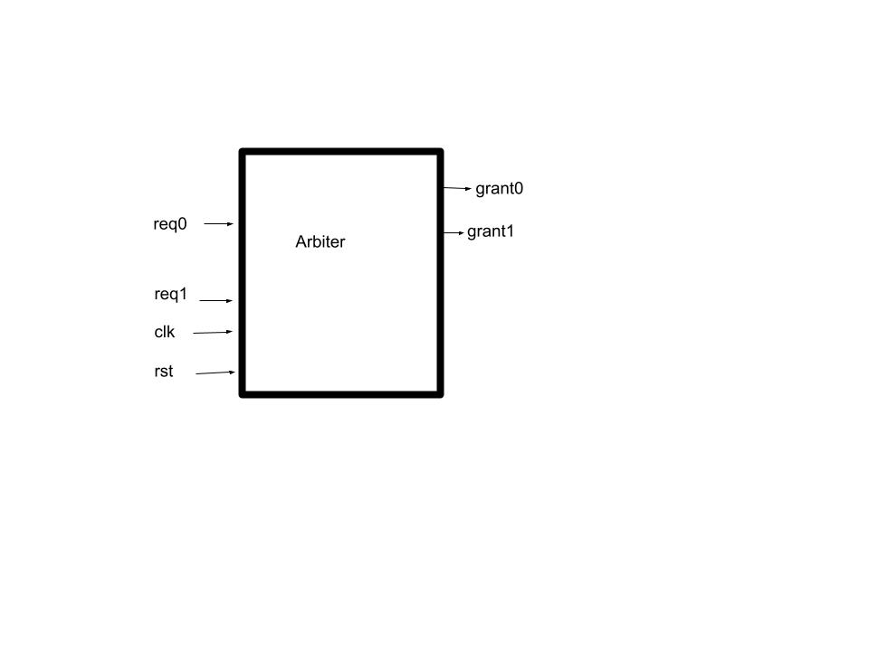

## Coding Scenario 


#### Question 
```md
---
Q2: Develop a verification plan for the following arbiter
---
```
#### Arbiter


```md
**Description**
Above diagram shows the block diagram of an arbiter that controls 2 requesting agents and generates 2 grants to each of the agent in a round robin order. 

**Specification**
Assume that each of the requesting agent can assert the request signal (Req 0/1) independently and will hold it asserted until the arbiter gives them grant for a pulse. The arbitration order is Req0 followed by 1 in a round robin fashion. Given that there are 2 requesting agents, each of them should get a grant at least once in 2 cycles. This also means that if a request is asserted, the grant signal for that agent should be assigned in a maximum of 2 cycles. 
```
```
Following things can be verified with assertion-

1) In any cycle, there can be only one grant signal that can be asserted.

2) Each requesting agent should get a grant signal in a maximum 2 cycle window.

3) If one requesting agent gets a grant, it cannot receive another grant unless no other agent is requesting.

4) If there are no requests, there cannot be any grants asserted

```
#### Stretch question on above
```md
---
Q2.1: Write a checker to check that if 1 request is asserted another request should not be asserted in the next clock cycle but can come any time after. i.e., back to back request not possible.
---
```
```cpp
//Make the forbidden sequence
//Method 1
sequence req0_b2b;
@(posedge clk)
	req0 |->##1 req0;
endsequence

property p_req0_b2b;
 not seq;
endproperty

req0_b2b_chk: assert property(p_req0_b2b);

//It means that above sequence will never happen.
//If it happens, property fails

sequence req1_b2b;
@(posedge clk)
	req1 |->##1 req1;
endsequence

property p_req1_b2b;
 not seq;
endproperty

req1_b2b_chk: assert property(p_req1_b2b);
//It means that above sequence will never happen.
//If it happens, property fails
```

```cpp
//Method 2

property req0_b2b;
	@(posedge clk)
	  req0 |-> ($past(req0,1)==1'b0); //In the previous cycle it cannot go high
endproperty

req0_b2b_chk : assert property (req0_b2b);

//Similarly for req1 ....
```

#### Stretch question on above

```md
---
Q2.2 Write a checker to check that if request is asserted, then grant should be asserted in the next clock or in the next to next clock (2 cycle window)
---
```

```cpp
property req0_followed_by_grant0;
	@(posedge clk) req0 |-> ##[1:2]grant0 ;
endproperty: req0_followed_by_grant0

chk0 : assert property (req0_followed_by_grant0);


property req1_followed_by_grant1;
	@(posedge clk) req1 |-> ##[1:2]grant1 ;
endproperty: req1_followed_by_grant1

chk1 : assert property (req1_followed_by_grant1);
```

#### Question 3
```md
---
Q3: Write an assertion/checker to catch the following cases-

a) Check if count variable increments everytime signal valid is set
b) write_data should be stable until write_ack arrives
c) If valid is asserted, it should remain high until ready is received
---
```
```cpp
//a
property p_a;
	@(posedge clk)
	valid |-> count == ($past(count)+1);
endproperty
p_a_chk: assert property (p_a);
```
```cpp
//b
property p_b;
 @(posedge clk)
  (wr && !wr_ack) // wr is on but wrdata is not yet acked 
   |-> ##1 (write_data == $past(write_data)); //write data should be stable
endproperty
p_b_chk: assert property (p_b);
```

```cpp
property p_c;
 @(posedge clk)
  (valid && !ready)
   |-> ##1 valid; //because valid can get deasserted only after ready comes
endproperty
p_c_chk: assert property (p_c);
```


