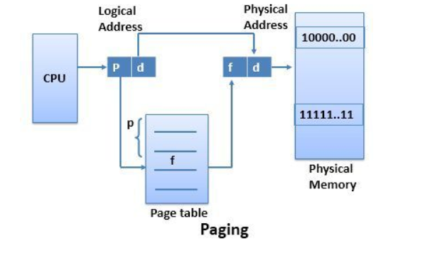
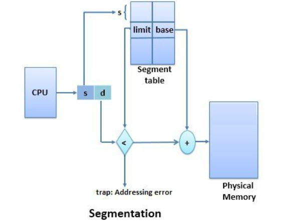

```
Q1) Difference between Paging and Segmentation
```
```
The MMU in the Computer architecture is an essential functionality, which allows the allocation of memory to the processes for execution and deallocates the memory when the process is no longer needed.
```
```
The basic difference between paging and segmentation is that, “page” is a fixed-sized block whereas, a “segment” is a variable-sized block. 
```


| BASIS FOR COMPARISON | PAGING                                |SEGMENTATION                           |
| :------------------: | :-----------------------------------: | :-----------------------------------: |
| Basic                | A page is of **fixed** block size     | A segment is of **variable** size     |
| Fragmentation        | May lead to **internal fragmentation**| May lead to **external fragmentation**|
| Address Calculation  | logical address =<br/>page no(which page)+offset(where in page)| logical address =</br>segment no(which segment)+offset(limit in segment)|
| Size                 | Size is decided by MMU                | Segment size can be configured by user|
| Translation Table    | Paging involves a page<br/>table that contains base address of each page| Segmentation involves the segment<br/> table that contains segment number and offset (segment length)|


```md
- Key Differences Between Paging and Segmentation-
1) The basic difference between paging and segmentation is that a page is always of fixed block size whereas, a segment is of variable size.
2) Paging may lead to internal fragmentation **as the page is of fixed block size, but it may happen that the process does not acquire the entire block size which may generate the internal fragment/holes in memory. The segmentation may lead to external fragmentation as the memory may be filled with the variable sized blocks/holes.**
3) In paging the user only provides a single integer as the address which is divided by the hardware into a page number and Offset. On the other hands, in segmentation the user specifies the address in two quantities i.e. segment number and offset.
4) The size of the page is decided or specified by the hardware. On the other hands, the size of the segment is specified by the user.
5) In paging, the page table maps the logical address to the physical address, and it contains base address of each page stored in the frames of physical memory space. However, in segmentation, the segment table maps the logical address to the physical address, and it contains segment number and offset (segment limit).
```

### Definition of Paging




```
Paging is a memory management scheme. Paging allows a process to be stored in a memory in a non-contiguous manner.

For implementing paging the physical and logical memory spaces are divided into the same fixed-sized blocks. 

These fixed-sized blocks of physical memory are called frames, and the fixed-sized blocks of logical memory are called pages.

When a process needs to be executed the process pages from logical memory space are loaded into the frames of physical memory address space. 

Now the address generated by CPU for accessing the frame is divided into two parts i.e. page number and page offset.


The page translation table uses page number as an index; each process has its separate page table that maps logical address to the physical address. 

The page table contains base address of the page stored in the frame of physical memory space. 

The base address defined by page table is combined with the page offset to define the frame number in physical memory where the page is stored.
```

### Definition of Segmentation




```
Segmentation is also a memory management scheme. It supports the user’s view of the memory. 

The process is divided into the variable size segments and loaded to the logical memory address space.

The logical address space is the collection of variable size segments. 
Each segment has its name and length. 
For the execution, the segments from logical memory space are loaded to the physical memory space.

The address specified by the user contain two quantities the segment name and the Offset. The segments are numbered and referred by the segment number instead of segment name. 
This segment number is used as an index in the segment table, and offset value decides the length or limit of the segment. 
The segment number and the offset together combinely generates the address of the segment in the physical memory space.

```

