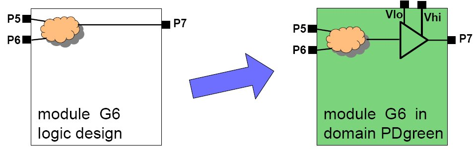

## Level Shifter

```md
Level shifter translates from one voltage to another i.e., upshift or downshift. 
UPF provides set_level_shifter construct to achieve this.
```

```md
**Syntax**

set_level_shifter <level_shifter_name>
-domain <domain_name>
[-elements <list> ]
[-applies_to ]
[-threshold <value> ]
[-rule ]
[-location ]
[-no_shift ]

```

#### Example


 

```cpp

set_level_shifter my_level_shifter \
    -domain PD_green \
    -rule low_to_high \
    -location self \
    -applies to outputs \
    -threshold 0.04
```

```md

- Suppose we want to add a level shifter in the power domain named PD_green which applies to outputs.
- Here, the signal going from lower voltage (p5 or p6)to higher voltage(p7) get a low_to_high level shifter when the voltage difference exceeds the specified threshold (0.04 V).

```

