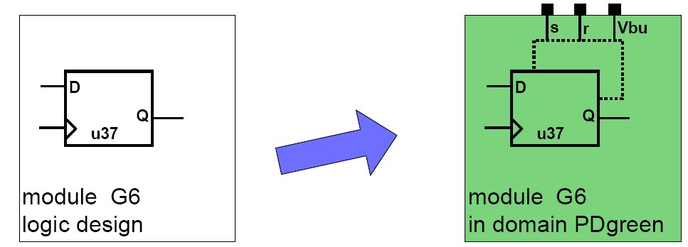

## Retention Cells

```md
UPF provides set_retention and set_retention_control constructs to add retention strategy in the design.
```

```md
**Syntax**

set_retention <retention_name>
-domain <domain_name>
[-retention_power_net <net_name> -retention_ground_net <net_name> ]
[-elements <list> ]

set_retention_control <retention_name>
-domain <domain_name>
-save_signal <net_name>
-restore_signal <net_name>

```

#### Example


 

```cpp

set_retention ret3 \
    -domain PD_green \
    -retention_power_net Vbu \ //Backup power supply 
    -elements u37 //Name of retention cell

set_retention_control ret3
    –domain PD_green \
    –save_signal s \ //Save signal
    –restore_signal r //Restore Signal
```

```cpp

//Verilog code mimicking retention cell

reg save_q; // shadow register
always @( posedge s )
begin // save 
save_q <= q;
end

always @( negedge r )
begin // restore
q <= save_q;
end

```

