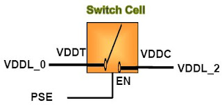

## Power Switches

```md
An element that connects power to the power domain supply from the permanent power supply rail depending on the control signal from the PMU
```

```md
**Syntax**

create_power_switch <switch_name>
-domain <domain_name>
-output_supply_port {<port_name> <supply_net_name>}
-input_supply_port {<port_name> <supply_net_name>}
-control_port {<port_name> <net_name>}
-on_state {<state_name> <boolean_function>}
-off_state {<state_name> <boolean_function>}

```

#### Example


 

```cpp

create_power_switch switch_cell \

    -domain PD_green \

    -input_supply_port [list VDDT VDDL_0] \ //Input supply

    -output_supply_port [list VDDC VDDL_2] \ //output supply

    -control_port [list EN PSE] \ //Switch enable

    -on_state [list on_state VDDT EN] \ //ON state

    -off_state [list off_state OFF {!EN}] //OFF state
```

```md

- The switch is ON based on the ON state of the control signal (PSE) from Power Management Unit , and drives the value specified on the input supply port (VDDL_0) on the output supply port (VDDL_2).
- The switch is OFF based on the OFF state of the control signal (PSE) from Power Management Unit , and then OFF state is driven on the output supply port (VDDL_2).
```

