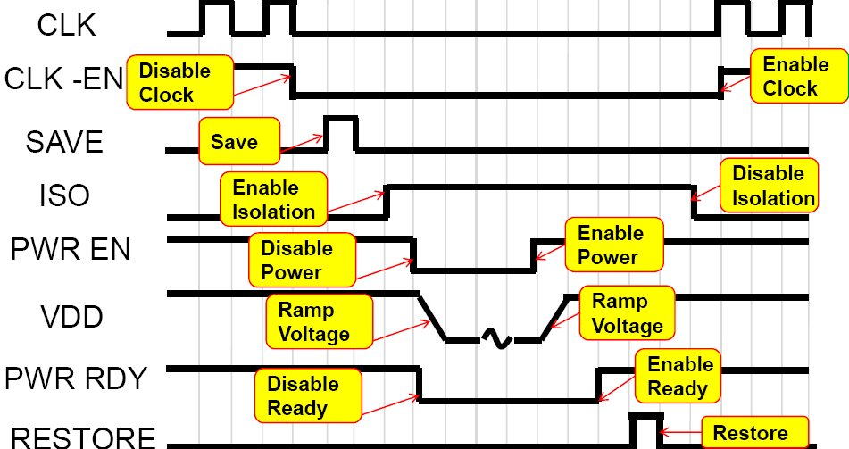

## Power Entry and Exit Sequence

```md
Few control signals required :
1. Control Signal for the Power Switch (PWR_EN)
2. Control Signal for the Isolation Cell Enable (ISO_EN)
3. Control Signal for the retention flops (SAVE and RESTORE)
```

#### Example


 


```md

All the above signals need to be generated in the right order to avoid malfunction of the circuit.
One of the sequence to follow :-

## To power-down the block - (power down entry):
1. Disable the clock
2. Generate SAVE : This will indicate that the contents of the main register in the power gated block has moved into the retention latch.
3. Generate ISO_EN: This will enable isolation cells to be active and clamp the output of the power gated block to either '1' or '0'.
4. Since all the basic elements are informed of the shut-down operation, now disable the PWR_EN, to turn off the power rails, that control specific blocks.

## To power_up the block - (power down exit):
1. Generate PWR_EN, to turn on the power rails, that control specific blocks.
2. Disable ISO_EN : This will disable isolation cells. Once disabled, the output of the power gated block is connected to the next power-on block.
3. Generate RESTORE : The main register in the power gated block restore the data saved in retention latch.
4. Enable the clock.

```

